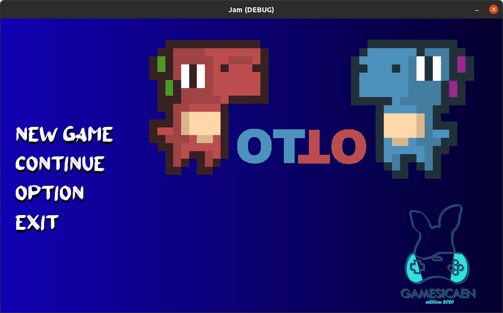
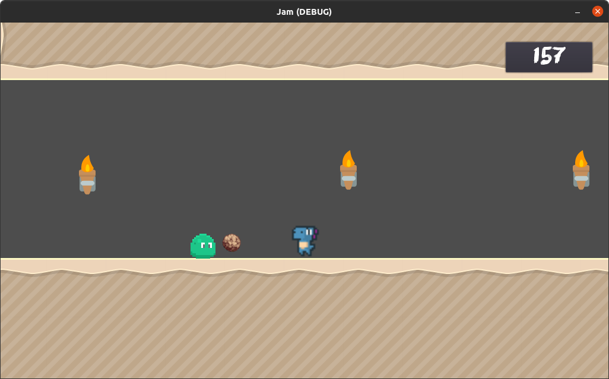
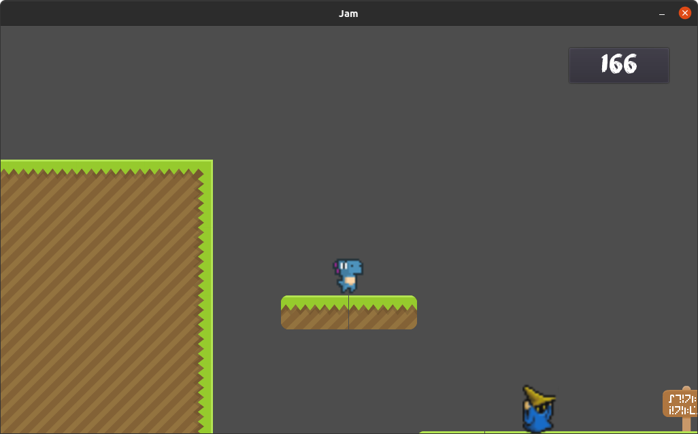

# ENSICAEN_GameJam
GameJam organised by ENSICAEN, December 2020

## Pour jouer 

* flèches directionelle ou <q> et <d> pour se déplacer à gauche et à droite
* <a> pour lancer un rocher
* <espace> pour interagir avec l'environemment (porte, levier)

## Plot

Vous êtes OTTO un jeunes dinosaure qui un jour rencontre un mystérieux magicien. Vous décidez de le suivre...

## Objectif

* Pour finir un niveau, vous devez atteindre un levier à la fin de celui-ci et l'actionner 

(P.S.): le niveau 4 est bien faisable, il suffit de lire attentivement le panneau 

## Screenshots

Menu :

Élément de gameplay, lancer des rochers sur ses ennemis :

Apparition du magicien :

## Credits

- Arch&Type :
    - Taedriel <isam.delorme@gmail.com> 
    - ln-dev05 <lord.nightmare05@gmail.com>
